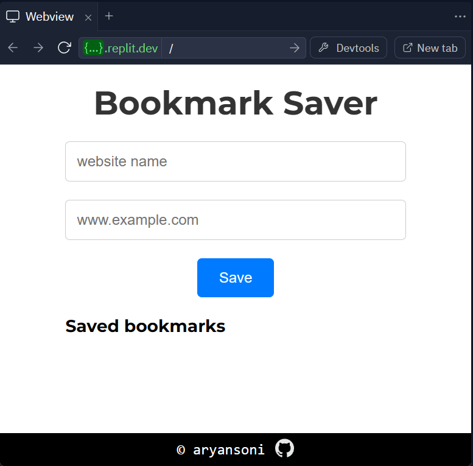

# Bookmark Saver 🔖

## Description

This is a simple web application that allows users to save their favorite website bookmarks. Users can enter the name and URL of the website they want to bookmark, and then click the "Save" button to store it. The saved bookmarks are displayed below with the option to remove them individually.

## Table of Contents

1. [Features](#features)
2. [Technology Used](#technology-used)
3. [Author](#author)
4. [Instructions](#instructions)

## Features

- Add website name and URL.
- Save bookmarks.
- Display saved bookmarks with links.
- Remove bookmarks individually.
- Responsive design.

## Technology Used

- HTML
- CSS
- JavaScript
- Hosted on Replit

## Author

Created by Aryan Soni. Find more on GitHub: [Aryan Soni's GitHub](https://github.com/aryansoni-git)

## Instructions

1. Enter website name and URL.
2. Click "Save" to store.
3. View saved bookmarks below.
4. Click "Remove" to delete.

Enjoy saving your favorite websites with Bookmark Saver!

## Contact

If you have any questions or suggestions regarding this project, feel free to contact me:

|  | 
 | 
 | 
 | 
[Instagram](https://www.instagram.com/aryansoni.ig/) |